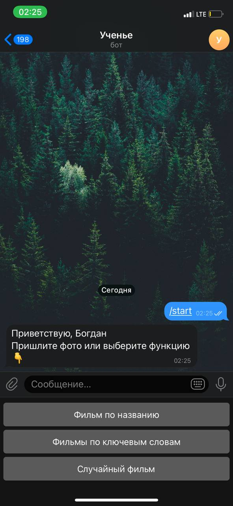
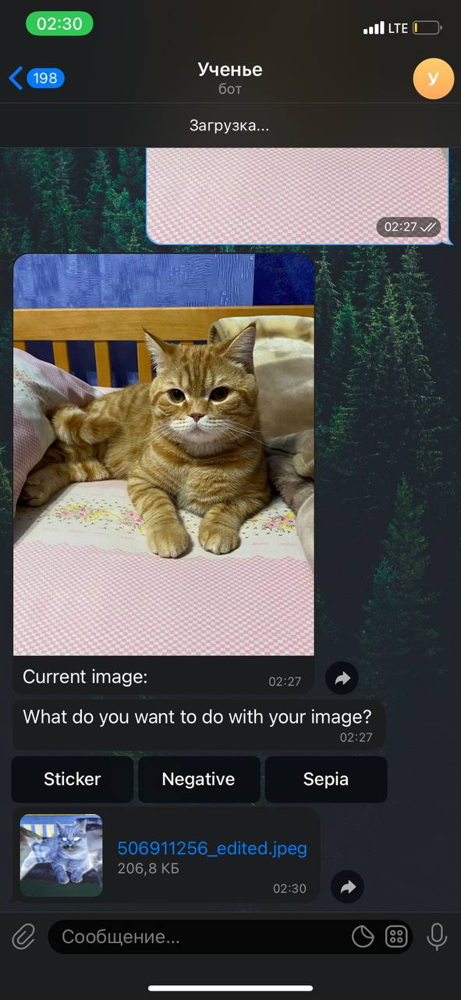
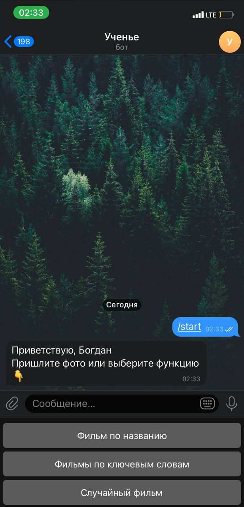
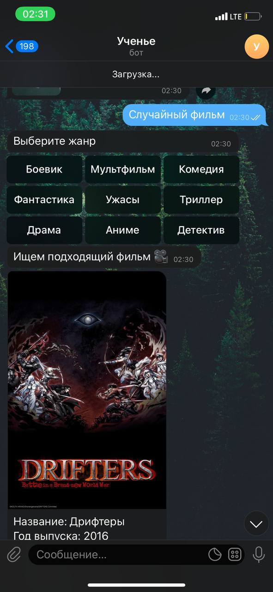

<h1 align="center">Multifunctional telegram bot</h1>

## Description

This multifunctional bot is written in node.js whit async functions. This bot can be used as your personal calendar, in this bot you can pedit photos and search for movies by title, key words or get a random movie by genre.

## How to use

### Start of usage

 * To start bot you should use command /start and then you can choщse options.

### Calendar

 * To use calendar you should use command /calendar and enter date in this form month.year then you you will get the full calendar for this month and year.

### Photo editor

 * To use a photo editor you should sent to bot your photo then you should choose one of the options.

 

 * After you have chosen one of the options the bot will send you edited photo

### Film finder

 * This bot function allows you to find a movie in three categories, to get started, select one of the options

 * If you choose option random film and choose genre of random film, bot will send you a random film with film with the selected genre.

* If you choose option find a movie by title or keyword you should send a message with title or keyword, then bot send you film or list of films

## Participants:
 * Nikita Gryshak - https://github.com/holdennekt
 * Bohdan Pinchuk - https://github.com/BogPin
 * Danil Byaliy - https://github.com/DanilByaliy

## License
This program is distributed under an [MIT License](https://github.com/DanilByaliy/Async-telegram-bot/blob/main/LICENSE).